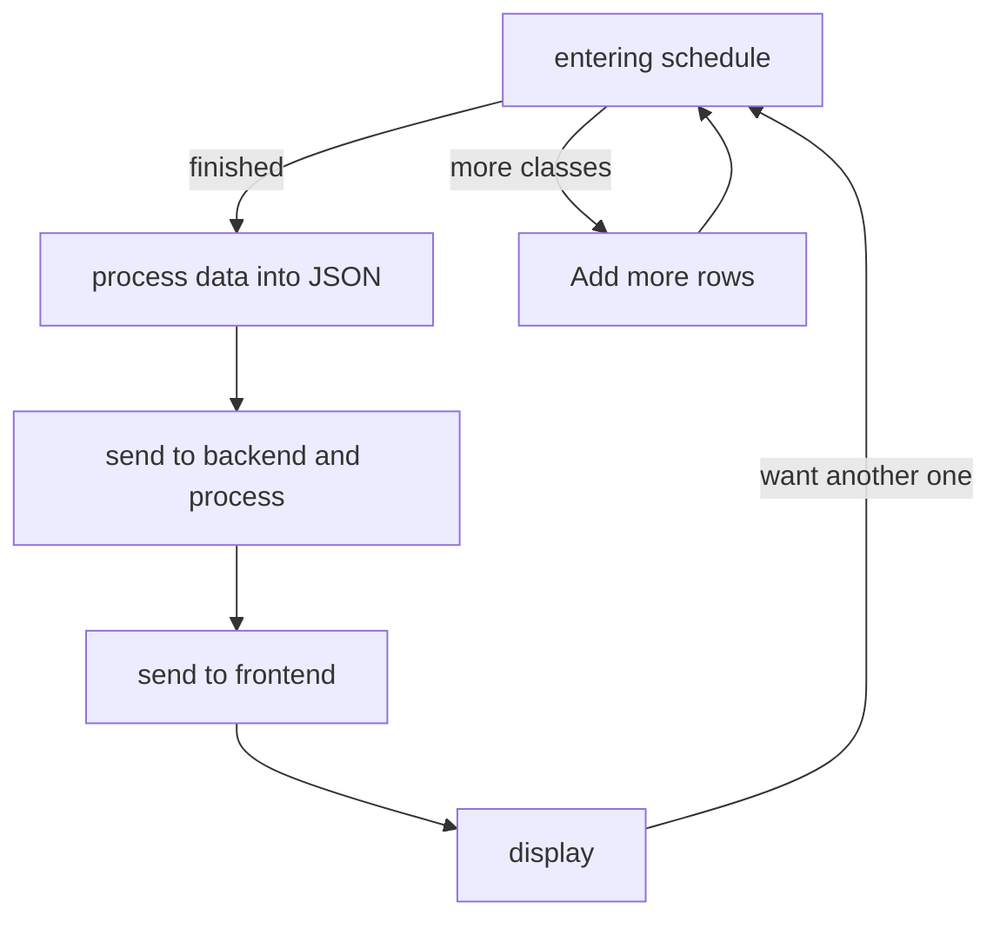

### Concept
I would like to develop an application that allows students to enter
their class schedule into the program and have it generate a table
showing the times each day they have class. 
It would be
great if this could be a web application.

---

### 1. High-Level Requirements
Build a web interface that allows students to enter their schedule,
the program then generate a time table that reflect the student's daily schedule.

---

### 2. Technical Specifications
#### Web Interface (4 hours)
There needs to be fields where students enter 
1. *what class this is,*
2. *Start time and end time for this class,*
3. *days of the week the class happens.* 

There should initially be a set number of fields, and if the student
wants more, there needs to be a button that asks 
"add more classes" which when clicked display one more fields. 
There also needs to be a button "finished" that when clicked, send 
the entered data to the server and displays the generated table of schedule.

#### Schedule Generation (4 hours)
Store the input into a text file, parse it into a data structure in
the backend program, then use some api to convert the data to a user
friendly schedule chart.

---

### 3. Detailed Design
#### 1. hardware and software requirement
1. front-end: **any device** that **supports a modern browser**
2. back-end: powerful **server** that runs **java**

---

#### 2. first interface

***enter your classes:***
| class  | start  | end    | Which Day? |
| ------ | ------ | ------ | :--------: |
| &nbsp; | &nbsp; | &nbsp; |   &nbsp;   |
| &nbsp; | &nbsp; | &nbsp; |   &nbsp;   |
| &nbsp; | &nbsp; | &nbsp; |   &nbsp;   |

<button type="button">more classes?</button>
<button type="button">finished?</button>

---

#### 3. display of schedule

| time   | Monday | Tuesday | ...... | Sunday |
| ------ | ------ | ------- | :----: | ------ |
| 8am    |        |         |        |        |
| ...... |        |         |        |        |
| 8pm    |        |         |        |        |

<button type="button">another one?</button>

---

#### 4.flow chart

---

### 4. Testing
1. **White Box Test**
   click finished without entering anything,
   the user should be prompted to enter something
2. **White Box Test**
   enter classes with conflicted time. the user should be
   prompted of this issue.
3. **White Box Test**
   enter a class with missing field, the user should be
   prompted with this error.
4. **Stress testing**
   Sends 100000000 request to the backend server and
   see how it handles.
5. **Stress testing**
   submit a schedule with 10000000 classes with no overlapping
   times and missing fields
6. **white Box testing**
   enter 7 classes that are formatted correctly
7. **white box testing**
   enter classes with characters from languages other than english,
   should have no issue.

### 5. Deployment
- Step 1 - **push the application to a live server**
- Step 2 - **ensure all of the data was migrated**
to the live server from the existing system
 To do this, run the sha application and compare 
 the hash of each file
- Step 3 – **perform a full test of the
application**
- Step 4 - **test with real person**
- Step 5 - **Go live and provide access to public**