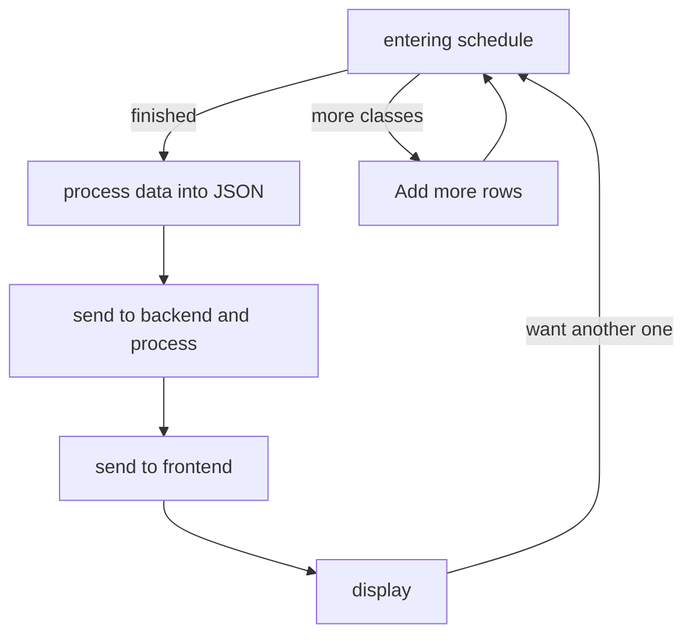

### Concept
I would like to develop an application that allows students to enter
their class schedule into the program and have it generate a table
showing the times each day they have class. It would be
great if this could be a web application.

---

### 1. High-Level Requirements
Build a web interface that allows students to enter their schedule,
the program then generate a time table that reflect the student's
daily schedule.

---

### 2. Technical Specifications
#### Web Interface (4 hours)
There needs to be fields where students enter 
1. *what class this is,*
2. *Start time and end time for this class,*
3. *days of the week the class happens.* 

There should initially be s set number of fields, and if the student
wants more, there needs to be a button that asks "add more classes" which when clicked display one more fields. There also needs to be a button "finished" that when clicked, send the entered data to the server and displays the generated table of schedule.

#### Schedule Generation (4 hours)
Store the input into a text file, parse it into a data structure in
the backend program, then use some api to convert the data to a user
friendly schedule chart.

---

### 3. Detailed Design
#### 1. hardware and software requirement
1. front-end: **any device** that **supports a modern browser**
2. back-end: powerful **server** that runs **java**

#### 2. first interface

***enter your classes:***
| class  | start  | end    | Which Day? |
| ------ | ------ | ------ | :--------: |
| &nbsp; | &nbsp; | &nbsp; |   &nbsp;   |
| &nbsp; | &nbsp; | &nbsp; |   &nbsp;   |
| &nbsp; | &nbsp; | &nbsp; |   &nbsp;   |

<button type="button">more classes?</button>
<button type="button">finished?</button>

---

#### 3. display of schedule

| time   | Monday | Tuesday | ...... | Sunday |
|--------|--------|---------|:------:|--------|
| 8am    |        |         |        |        |
| ...... |        |         |        |        |
| 8pm    |        |         |        |        |

<button type="button">another one?</button>

---

#### 4.flow chart

---

### 4. Testing
TEST CASE 1:

### 5. Deployment